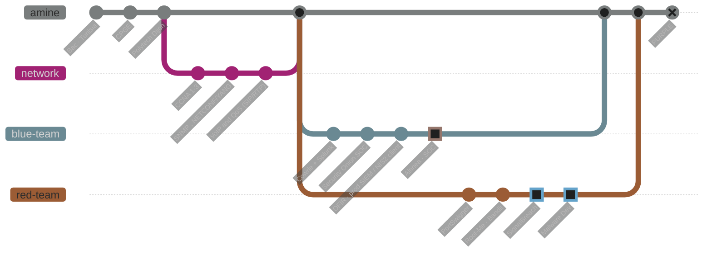
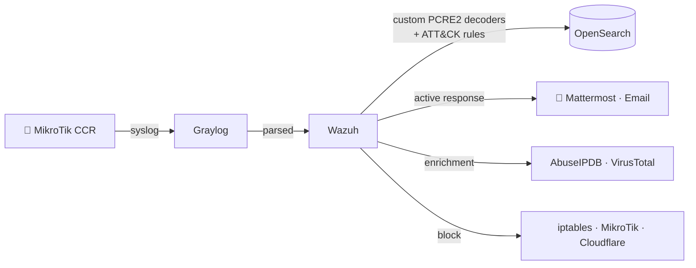

<!-- ═══════════════════════════════  HEADER  ═══════════════════════════════ -->


<p align="center">
  
</p>

<p align="center">
  <a href="https://linkedin.com/in/namouchimohamedamine"></a>
  <a href="mailto:Mohamed-Amine_Namouchi@etu.ube.fr"></a>
  
  
</p>

<br>

<!-- ═══════════════════════════════  TL;DR  ═══════════════════════════════ -->
<table align="center">
<tr>
<td align="center" width="33%">

### 🔵 Blue by day
**SOC Analyst** (work-study)<br>
@ **Altinea** — MSSP<br>
<sub>SIEM · correlation · hardening · IPS</sub>

</td>
<td align="center" width="33%">

### 🔴 Red by night
**Web · Network · Malware Dev**<br>
PortSwigger · Root-Me · OverTheWire<br>
<sub>SSRF → Gopher → Redis → RCE</sub>

</td>
<td align="center" width="33%">

### 🌐 Network-native
**CCNA 1–3 · heading for CCNP**<br>
OSPF · BGP · VLAN · IPSec · QoS<br>
<sub>NETCONF/YANG · SNMP · Zabbix</sub>

</td>
</tr>
</table>

> **I'm a final-year network security engineering student who ships detection to production — and then attacks it.**
> Two production SIEMs deployed before graduating. Thousands of false positives killed. Now I'm building the other half: the attacker's mindset.

---

## `$ git log --graph --career`



<sub>🔵 blue and 🔴 red branches run in parallel — I learn offense and defense at the same time, then merge them.</sub>

---

## `$ cat impact.log`

<div align="center">

| | Metric | Context |
|:---:|:---|:---|
| 🧹 | **~9,300 false positives eliminated** | Zabbix audit — root-caused a Proxmox LXC memory trigger |
| 🛡️ | **50+ client vhosts monitored** | Production SIEM on a shared WordPress/Laravel hosting server |
| 🏭 | **2 production SIEMs shipped** | Incl. one for a NIS2 *important entity* — built on bare metal |
| 📈 | **CIS compliance 48% → 79%** | NIS2 / CIS Benchmark hardening on Ubuntu 24.04 |
| 🧬 | **21+ custom rules · 9 Sigma rules** | Custom PCRE2 decoders, every rule mapped to MITRE ATT&CK |
| 🔭 | **CCNA → CCNP in progress** | Network-native profile: OSPF, BGP, QoS, NETCONF/YANG |

</div>

---

## `$ ./operations --active`

<table>
<tr>
<td width="50%" valign="top">

### 📡 [SignalBreach](https://github.com/MedNamouchi/SignalBreach)
**What happens to call quality when someone attacks your VoIP stack?**

Docker lab (Asterisk · MediaMTX · Suricata) → QoS baseline (jitter, loss, MOS via E-model) → **live attacks** (SIPVicious cracking, INVITE floods, RTP eavesdropping via ARP spoofing) → **remediation** (SRTP/TLS, Fail2ban) → replay the same attacks to prove the fix.

`SIP` `RTP/RTCP` `RTSP` `Docker` `Suricata` `Python`

</td>
<td width="50%" valign="top">

### 🧬 Malware Development
**Learning to build what the blue team has to catch.**

Hands-on offensive tradecraft — studying payloads, droppers and evasion from the attacker's side, so my detections are sharper on the other end.

`Offensive R&D` `Windows` `Evasion` `Detection-aware`

</td>
</tr>
<tr>
<td colspan="2" align="center">

### 🧪 `[REDACTED]`
<sub>Still in the lab: the **Sentinel Breach** purple-team cyber range, and a long-term **AI purple team platform** (autonomous offensive agent + defensive SOC agent). Not public yet. 👀</sub>

</td>
</tr>
</table>

---

## `$ ./operations --shipped`



> **SIEM-MikroTik-Wazuh-Graylog** — the pipeline above, from EVE-NG prototype to commercial deployment. Multi-layer IP blocking, FIM on 14 critical paths, 6-month retention. → [repo](https://github.com/MedNamouchi/SIEM-MikroTik-Wazuh-Graylog)

### 🎓 Academic projects

| Project | What it does | Stack |
|---|---|---|
| **NETCONF & YANG** | Atomic config & inter-VLAN routing automation via XML against YANG models, replacing legacy SNMP/CLI workflows | `NETCONF` `YANG` `GNS3` |
| **Cowrie + SIEM** | SSH/Telnet honeypot capturing & correlating intrusion attempts in Splunk, with a Telegram bot for live attack alerts | `Cowrie` `Splunk` |
| **SOC on Security Onion** | Full SOC stack for detection & incident investigation, with alert triage and IR procedures | `Suricata` `Zeek` |

### 📂 Pick a repo

<sub>Click to expand 👇</sub>

<details>
<summary><b>📡 SignalBreach</b> — VoIP security & QoS under attack</summary>
<br>
Multimedia signaling (SIP / RTP / RTSP) lab: measure QoS, attack it, defend it, replay to validate.
<br><br>
<a href="https://github.com/MedNamouchi/SignalBreach"></a>
</details>

<details>
<summary><b>🛰️ SIEM-MikroTik-Wazuh-Graylog</b> — end-to-end detection pipeline</summary>
<br>
Production SIEM built from scratch across EVE-NG simulation and physical MikroTik CCR routers.
<br><br>
<a href="https://github.com/MedNamouchi/SIEM-MikroTik-Wazuh-Graylog"></a>
</details>

<details>
<summary><b>➕ More</b> — all repositories</summary>
<br>
<a href="https://github.com/MedNamouchi?tab=repositories"></a>
</details>

---

## `$ arsenal --list`

<div align="center">


<br><br>


<sub>🔵 detect · 🔴 exploit · 🟣 network & infra</sub>

</div>

---

## `$ cat training.status`

```diff
+ [DONE]  CCNA 1-3  ·  2 production SIEMs shipped (one NIS2 important entity)
+ [DONE]  PortSwigger — SSRF, WebSockets, Web Cache Deception (Expert CSRF+WCD lab)
+ [DONE]  Root-Me — SSRF → Gopher → Redis → RCE  ·  OverTheWire Bandit
+ [DONE]  Custom PCRE2 decoders + 9 Sigma rules, all MITRE ATT&CK-mapped
! [WIP]   Malware development  ·  network & web exploitation
! [WIP]   CCNP  ·  PortSwigger Academy — remaining topics
- [NEXT]  Cloud & DevOps for the cyber range
- [LONG]  Vulnerability research → 0-days
```

---

## `$ github --stats`

<div align="center">


</div>

---

<div align="center">

### `$ echo "let's talk"`
**Open to:** purple team collabs · CTF teams · security research · VoIP / network security discussions

[](https://linkedin.com/in/namouchimohamedamine)
[](mailto:Mohamed-Amine_Namouchi@etu.ube.fr)

<br>

*"I write the rules. Then I find the ways around them. Then I write better rules."*

</div>


